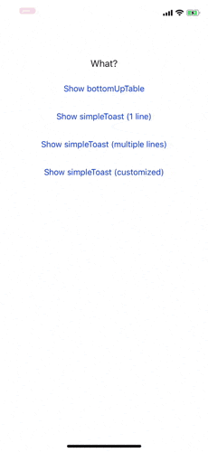

# YYBottomSheet

[](https://travis-ci.org/Yeom/YYBottomSheet)
[](https://cocoapods.org/pods/YYBottomSheet)
[](https://cocoapods.org/pods/YYBottomSheet)
[](https://cocoapods.org/pods/YYBottomSheet)

## Introduction

When you need to let user choose one of several, you can use YYBottomSheet. Simple And Clear 😎

## Example

To run the example project, clone the repo, and run `pod install` from the Example directory first.



## Usage

To create and show a bottomSheet, first of all, import the module at the beginning of the file:

```swift
import YYBottomSheet
```

Then just show the bottomSheet as below:

```swift
let bottomSheet = YYBottomSheet(title: "Fruits", dataArray: ["apple", "grape", "strawberry"]) { (cell) in
    // whatever you want to code
    // print("\(cell.indexPath.row) : \(cell.titleLabel.text)")
}
bottomSheet.show()
```

And button handler (SelectHandler) is just a lambda:

```swift
(YYBottomSheetCell) -> ()
```

You can customize several things as below:

```swift
public var allowTouchOutsideToDismiss: Bool
public var headerViewBackgroundColor: UIColor
public var headerViewTitleLabelTextColor: UIColor
public var tableViewCellLabelTextColor: UIColor
```

Check full example as below:

```swift
let title = "Fruits"
let dataArray = ["apple", "grape", "watermelon", "banana", "strawberry", "cherry", "pineapple", "pear"]

let bottomSheet = YYBottomSheet.init(title: title, dataArray: dataArray) { (cell) in
    // whatever you want to code
    // print("\(cell.indexPath.row) : \(cell.titleLabel.text)")
}

/* Customizable Variables
bottomSheet.allowTouchOutsideToDismiss = false
bottomSheet.headerViewTitleLabelTextColor = UIColor.red
bottomSheet.headerViewBackgroundColor = UIColor.yellow
bottomSheet.tableViewCellLabelTextColor = UIColor.blue
*/

bottomSheet.show()
```

## Installation

YYBottomSheet is available through [CocoaPods](https://cocoapods.org/pods/YYBottomSheet). To install
it, simply add the following line to your Podfile:

```ruby
pod 'YYBottomSheet'
```

## Author

DevYeom, dev.yeom@gmail.com

## License

YYBottomSheet is available under the MIT license. See the LICENSE file for more info.
